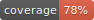

<div align='center' style='font-size:36px;font-weight:600;font-style:italic;'>
  AEKSION
</div>

  [](./public/coverage/coverage.svg)  
  [](https://github.com/rubocop/rubocop) [](https://badge.fury.io/gh/tterb%2FHyde) 
  
  <!---TODO: uncomment on first release []()
  
   
-->
<!--TODO: One Paragraph of the project description -->
## Getting Started

These instructions will give you a copy of the project up and running on
your local machine for development and testing purposes. See deployment
for notes on deploying the project on a live system.

```bash
git clone git@github.com:CreadixGal/aeksion.git
```

For local development, you will run this instructions
```ruby
bundle install
rails server
# or for improve your development experience skip rails server and run:
foreman start -f Procfile.dev
```
<!--TODO: ADD INSTRUCTIONS -->

### Prerequisites

Requirements for the software and other tools to build, test and push 
+ ``Ruby`` version: **3.1.2**
+ ``Ruby on Rails`` version: **7.0.4**
+ ``PostgreSQL`` version: **13.4**
+ ``RSpec`` version: **3.11.0**

### Installing


### Running the tests

```ruby
   rspec
   # or
   rspec spec/<folder>/<file>_spec.rb
```
### Deployment

<!--TODO:-->

### Authors

  - **Lucas Garcia** [(https://github.com/lucas94gv)](https://github.com/lucas94gv)
  
  - **Cisco González** [(https://github.com/ciscoLegrand)](https://github.com/ciscoLegrand)

### License

  <!--TODO: research which license is needed-->

### Acknowledgments

  <!--TODO: complete acknowledgements->

